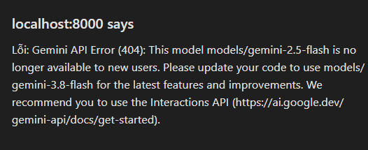

# ⚡ Daily English AI Tutor (Python + FastAPI + Gemini AI)

> 🎯 **Ứng dụng luyện giao tiếp tiếng Anh 10 câu/ngày dành riêng cho Kỹ sư AI (AI Engineer) & đời sống hằng ngày.**  
> Tích hợp phản xạ dịch Việt - Anh, nhận diện giọng nói (Microphone), phát âm bản ngữ US chuẩn Shadowing, và trợ lý chấm điểm / phân tích ngữ pháp chuyên sâu từ Google Gemini.

---

## 🌟 Tính Năng Nổi Bật

1. **🗺️ Lộ Trình 3 Tháng (90 Ngày) Cho Người Bắt Đầu Từ Số 0 (A0 → B1):**
   * **Giai đoạn 1 (Ngày 1 - 30): Xây Gốc & Ngữ Âm (A0 → A1):** Bảng 44 âm IPA, đại từ, To Be, thì Hiện tại đơn, số đếm, thói quen và 300 từ vựng sống còn.
   * **Giai đoạn 2 (Ngày 31 - 60): Phản Xạ Đời Sống & Công Việc (A1 → A2):** Thì Quá khứ đơn, Tương lai đơn, mẫu câu Daily Standup kinh điển (*Yesterday I worked on...*, *Today I will...*), email công việc và shadowing.
   * **Giai đoạn 3 (Ngày 61 - 90): Tự Tin & Kỹ Sư AI (A2 → B1):** Thuật ngữ AI (*Pipeline, latency, accuracy, fine-tuning, prompts*), giải thích nguyên nhân - kết quả (*due to, because*), thảo luận bug và đề xuất giải pháp kỹ thuật.
   * **Bảng 44 Âm Chuẩn Quốc Tế IPA Tương Tác:** Bấm vào bất kỳ nguyên âm hoặc phụ âm nào để nghe phát âm mẫu và xem từ ví dụ.
   * **Nhiệm vụ 3 bước mỗi ngày (Daily Quests):** Ôn 10 từ vựng ➔ Học 1 bài lý thuyết ➔ Luyện 5 câu phản xạ (15-20 phút/ngày).

2. **🗂️ Hệ Thống Học Từ Vựng Thông Minh (Spaced Repetition & Flashcard 3D):**
   * **Flashcard 3D lật thẻ:** Mặt trước hiển thị từ vựng, cấp độ, từ loại, IPA và nút phát âm giọng US; Mặt sau hiển thị nghĩa tiếng Việt, ví dụ thực tế và mẹo nhớ nhanh (Mnemonic Hook).
   * **Thuật toán Spaced Repetition (SRS):** 4 mức đánh giá 🔴 *Chưa nhớ* | 🟠 *Khó* | 🟡 *Tốt* | 🟢 *Dễ/Thuộc* (hỗ trợ phím tắt 1, 2, 3, 4 và phím cách Space để lật thẻ). Tự động lên lịch ôn tập ngắt quãng chống quên.
   * **✨ Tra & Phân Tích Từ Vựng Bằng Gemini AI:** Nhập bất kỳ từ tiếng Anh nào, AI tự động điền IPA, dịch nghĩa, viết câu ví dụ và mẹo nhớ.
   * **🎮 Mini Quiz Từ Vựng:** Game trắc nghiệm 4 lựa chọn thử thách phản xạ từ vựng nhanh.

3. **🧩 Chế Độ Giàn Giáo Cho Người Mới (Beginner Word Scramble):**
   * Trong màn hình luyện phản xạ, bật chế độ *"Ghép thẻ từ"*: Các từ vựng được chia nhỏ thành các thẻ bấm. Người học chỉ cần bấm chọn theo thứ tự đúng để ghép thành câu hoàn chỉnh mà không sợ viết sai chính tả hay bối rối trước màn hình trắng.

4. **20 Chủ đề giao tiếp thực chiến:**
   * **5 chủ đề Kỹ sư AI & Công nghệ:** Daily Standup, Explaining AI Models, Debugging & Production Incidents (CUDA OOM, Latency), Code Review, Technical Meetings.
   * **15 chủ đề đời sống hằng ngày:** Chào hỏi, Gọi món cafe/nhà hàng, Mua sắm, Sân bay, Khách sạn, Hỏi đường, Sức khỏe, v.v.

5. **Luyện Nói trực tiếp (Voice Input) & Shadowing (Text-to-Speech):**
   * Nhấn nút Micro để nói tiếng Anh qua Web Speech API.
   * Nghe AI đọc mẫu câu chuẩn bản ngữ US với 3 tốc độ: **0.8x**, **1.0x**, **1.2x**.

6. **Trí tuệ nhân tạo Gemini AI Coach & Grammarly Real-time:**
   * Chấm điểm từ 0 đến 100, chỉ rõ lỗi ngữ pháp bằng tiếng Việt, đề xuất cách nói tự nhiên của người bản xứ.
   * Kiểm tra ngữ pháp thời gian thực với 4 chỉ số (Correctness, Clarity, Engagement, Delivery) và sửa lỗi 1 chạm.

7. **Khởi tạo chủ đề học & Sinh thêm câu không giới hạn với Gemini AI:**
   * Tạo chủ đề tự chọn theo sở thích với nút "➕ Tạo chủ đề mới" và "✨ Sinh thêm câu".


---

## 🚀 Hướng Dẫn Khởi Chạy

Dự án được xây dựng 100% bằng **Python (FastAPI)** và giao diện Web Glassmorphic hiện đại.

### 1. Kích hoạt môi trường ảo & Khởi động Server
```powershell
# Kích hoạt môi trường ảo và chạy server FastAPI
.\.venv\Scripts\python.exe main.py
```

Server sẽ khởi chạy tại:
👉 **http://127.0.0.1:8000** (hoặc http://localhost:8000)

### 2. Cấu hình Gemini API Key
Bạn có thể cấu hình theo 1 trong 2 cách:
* **Cách 1 (Nhanh nhất):** Mở giao diện Web, bấm biểu tượng **Bánh răng (⚙️ Cài đặt)** ở góc trên bên phải, dán API Key vào và bấm *"Lưu cấu hình"*.
* **Cách 2:** Tạo file `.env` từ `.env.example` và điền key:
  ```env
  GEMINI_API_KEY=AIzaSy...
  ```
*(Nếu chưa có API Key, bạn có thể lấy hoàn toàn miễn phí tại [Google AI Studio](https://aistudio.google.com/)).*

---

## 📅 Lộ Trình 3 Tháng Bứt Phá Giao Tiếp Cho AI Engineer

* **Tháng 1: Phá băng phản xạ & Chuẩn hóa phát âm**
  * Mỗi ngày dịch và nói 10 câu trên App.
  * Bấm nút **Loa (0.8x hoặc 1.0x)** để nghe AI đọc mẫu, sau đó **nhại lại to rõ ràng 3 lần (Kỹ thuật Shadowing)** trước khi sang câu tiếp theo.
* **Tháng 2: Làm chủ giao tiếp công việc (Daily Standup & Tech Meetings)**
  * Tập trung vào 5 chủ đề công nghệ trên App: Báo cáo task, mô tả pipeline RAG/LLM, giải thích lỗi CUDA OOM.
  * Sử dụng nút **Micro** để nói trực tiếp thay vì gõ phím.
* **Tháng 3: Tự nhiên hóa ngôn từ & Thuyết trình kỹ thuật**
  * Đọc kỹ phần **"Cách nói tự nhiên hơn của người bản xứ"** để tích lũy phrasal verbs (*dig into, pin down, roll back, bring down latency*).
  * Mở **Sổ tay lỗi sai (📖)** cuối tuần để ôn lại toàn bộ những điểm ngữ pháp còn yếu.

---

## 🧪 Chạy Kiểm Thử (Tests)

Toàn bộ backend và dữ liệu đã được kiểm thử tự động bằng `pytest`:
```powershell
.\.venv\Scripts\pytest.exe
```

---

Chúc bạn có những giờ học tiếng Anh thật hứng khởi và đạt bước tiến nhảy vọt trong sự nghiệp AI Engineer!
